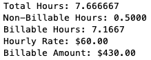

# Freelancer Timesheet Analyzer

> This project is a work in progress.

## Motivation

I use several spreadsheets to track my time: freelance work, school, and personal projects. Especially for my freelance work at invoice time, I need to be able to report how much time I spent on a particular project within a given date range. I also need to separate 'billable' from other types of work. I could use spreadsheet functions to filter and sum my time. However, I find this cumbersome. I also want to add more functionality, such as merging and analyzing data from multiple sheets.

### Solution
A Python program that reads timesheet data, prompts for filters (e.g. Project), and reports billable vs non-billable hours.

analyzer.py creates this report, plus it interactively allows you to adjust total billable hours to make invoicing easier (e.g. if you want to give a discount or add an additional hours). 



## Installation

Download analyzer.py or clone this repository.

## Usage example
Create a timesheet spreadsheet (requirements below).

Run analyzer, responding to prompts for filters:
```sh
python analyzer.py 
```

### Timesheet Requirements
---------------------------
Your timesheet can contain any number of columns in any order, but needs to include these minimum columns with these column headings: 
  * 'Project' (string) (such as customer, class, or project name)
  * 'Date' (date string format: %mm/%dd/%yy)
  * 'Hours' (float)
Optional:
  * 'Billable' (any value, it's simply tested for null-ness)
  * 'Details' (any string, it's simply included in the final report to help you decide if you want to make billable adjustments)
  
See /data for example.xls timesheet.


##TODO
  * Fix reporting 
  * Include generic filtering prompts instead of hard-coding.
